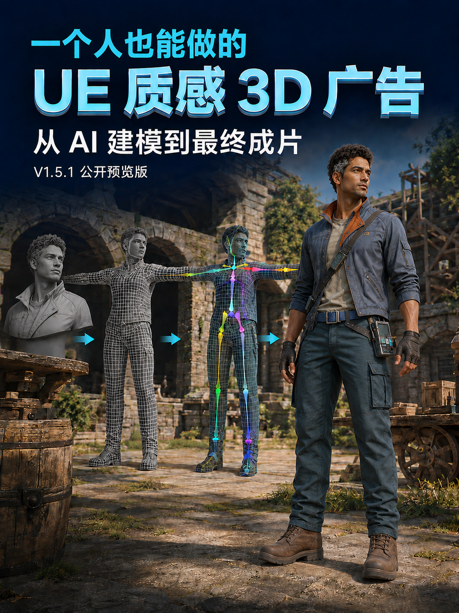

# 一个人也能做的 UE 质感 3D 广告

**3d-pipeline V1.5.1 · Codex Skill · 公开预览版**

用 Codex 组织 AI 建模、Blender 资产处理、Godot 场景与最终渲染。本文以 **15 秒竖屏广告** 为例，帮助初学者理解安装、配置、检查和确认的全过程。

[下载 V1.5.1 ZIP](https://github.com/bjdenghao-cn/codex-3d-pipeline/raw/refs/heads/main/3d-pipeline-v1.5.1-public.zip) · [图文使用指南](docs/USAGE.md) · [文件校验](SHA256SUMS.txt) · [反馈问题](https://github.com/bjdenghao-cn/codex-3d-pipeline/issues)

> **版本状态：**仍在修复完善。33 项单元测试通过只代表已有测试覆盖范围，不保证所有实际项目均可完成。
>
> **画面说明：**下方配图均为 AI 辅助生成的教学示意，不是本 Skill 的实机截图或成片证明。“UE 质感”是美术目标，当前渲染引擎为 **Godot 4**。

<p align="center">

</p>

## 第一次使用，从这里开始

1. **下载解压**上方 V1.5.1 ZIP，找到整个 `3d-pipeline` 文件夹。
2. **安装 Skill**：放进 `C:\Users\你的用户名\.codex\skills`，确保最终路径为 `3d-pipeline\SKILL.md`。已有同名文件夹先备份。
3. **重启 Codex**，复制下面的指令，让它先完成环境检查和项目配置。

```text
使用 $3d-pipeline 制作一条 15 秒、9:16 的 UE 质感 3D 广告。
原创角色、明亮自然光、画面干净无杂色、纹理克制。

先检查环境，说明缺少的软件或插件及部署方法。
再确认脚本、资产清单、预算和输出位置，并配置本项目。
每次告诉我：当前步骤、已完成、缺什么、我需确认什么、下一步。
付费调用先确认预算；默认先给代表帧，我确认后再渲染完整视频。
```

安装不等于项目已经配置完成。你需要告诉 Codex 广告主题和剧情，并提供可用素材；它再配置真实输入、输出和阶段检查。

## 需要准备什么？

| 必需 | 作用 |
| --- | --- |
| Codex + 本 Skill | 项目组织和执行 |
| Python 3.10+ | 执行器及检查脚本 |
| Blender 4.x | 模型、骨骼、动作、导出 |
| Godot 4.x | 场景、镜头、灯光、渲染 |
| FFmpeg / FFprobe | 视频封装和技术检查 |

**按项目选择：**Blender MCP、Mixamo、AI 3D 生成服务及额外绑骨/运镜/物理工具。Godot 默认使用 CLI/GDScript，不要求 Godot MCP。Mixamo 是外部服务，不是插件，需要用户自行登录并准备合法的本地文件。

[查看插件作用、替代方案和部署说明 →](docs/USAGE.md)

<details>
<summary>展开查看：必需工具与可选工具图解</summary>


</details>

## 自动执行到哪一步？

环境检查 → Blender 连接（按需）→ 模型检查 → 动作接入 → 骨骼检查 → 导出复验 → Godot 场景检查 → 代表帧 → 最终成片。

<p align="center">

</p>

| 模式 | 如何继续 |
| --- | --- |
| 默认模式 | AI 自动检查并生成代表帧，你确认后再渲染全片 |
| 已明确授权的受控无人托管 | 在项目确认范围内自检并继续，保留代表帧、关键帧和报告 |

缺文件、检查失败、阶段未配置或需要用户登录时仍可能暂停。自动执行不扩大预算、购买许可、公开发布或项目外操作的权限。

[查看四张小白检查图：模型 → 动作 → 场景 → 样张与渲染 →](docs/USAGE.md)

## 验证安装

在 PowerShell 中运行：

```powershell
$skill = Join-Path $env:USERPROFILE '.codex\skills\3d-pipeline'
python "$skill\scripts\pipeline.py" --help
python -m unittest discover -s "$skill\scripts\tests" -p 'test_*.py'
```

本次发布包已有 33 项单元测试通过。测试和帮助命令验证的是执行器，不替代实际项目验收。遇到 `pending` 或 `configured: false`，请先让 Codex 补齐本项目配置。

## V1.5.1 更新内容

- 项目级多模型顺序路由，记录真实模型和选择理由。
- 明确授权后支持受控无人托管执行。
- 沿用正式环境、角色/载具/道具关系、运动方向和 VFX 语义检查。
- 支持检查报告、状态记录、断点恢复及受影响阶段复验。

## 下载校验与许可

文件：`3d-pipeline-v1.5.1-public.zip`

SHA-256：

```text
6DE5EB5758C7A6B7D2D2EA6CBE6413F9258975F7153A120C0B48B852B8171D16
```

本仓库暂未附加开源许可证。除下载、安装和本地评估之外的复制、修改、再分发或商用授权，以权利人后续说明为准。

