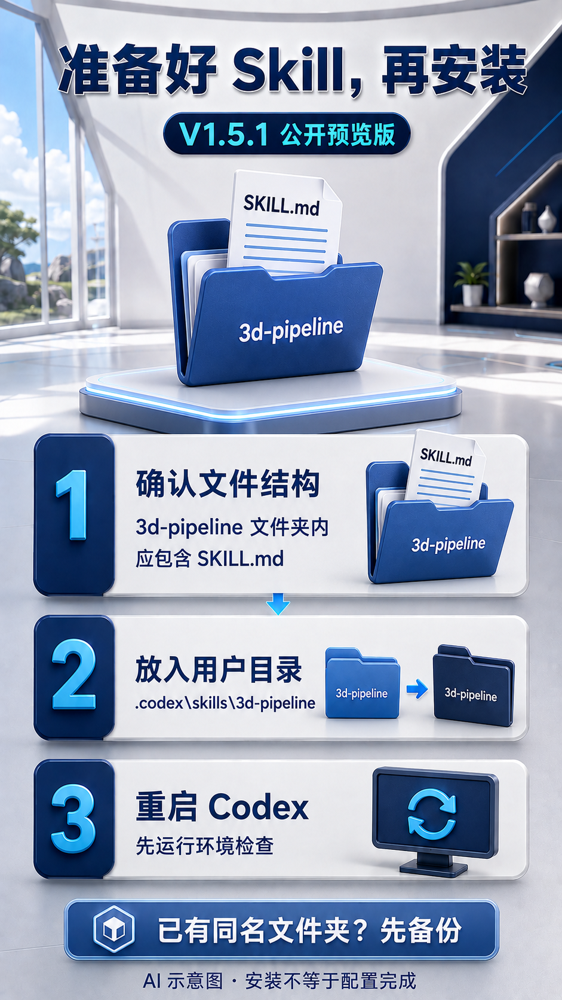
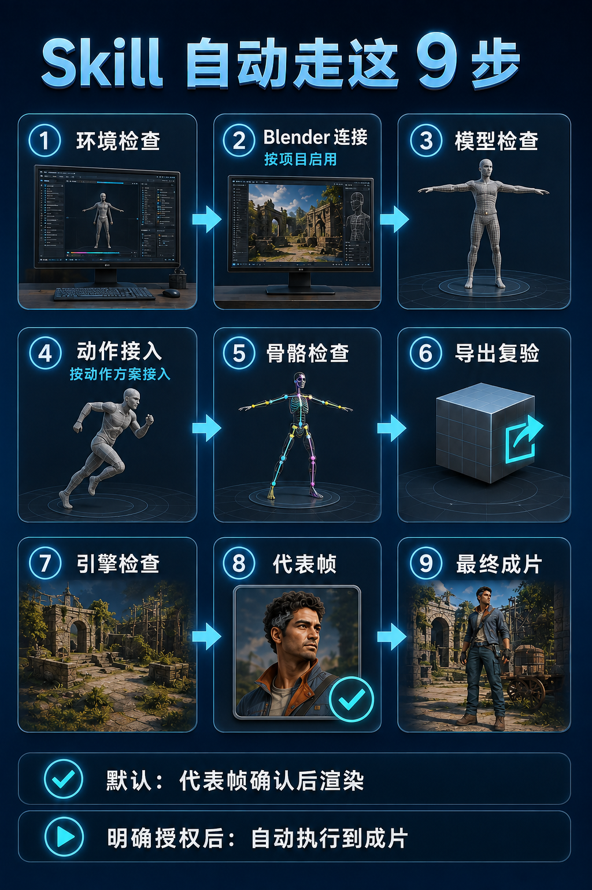
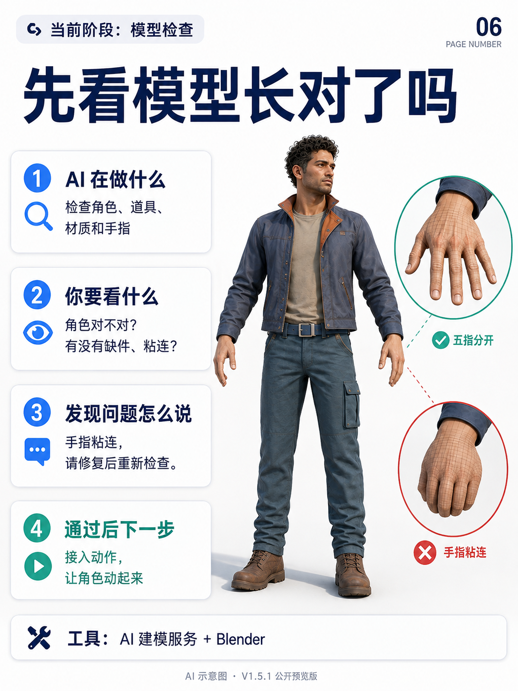
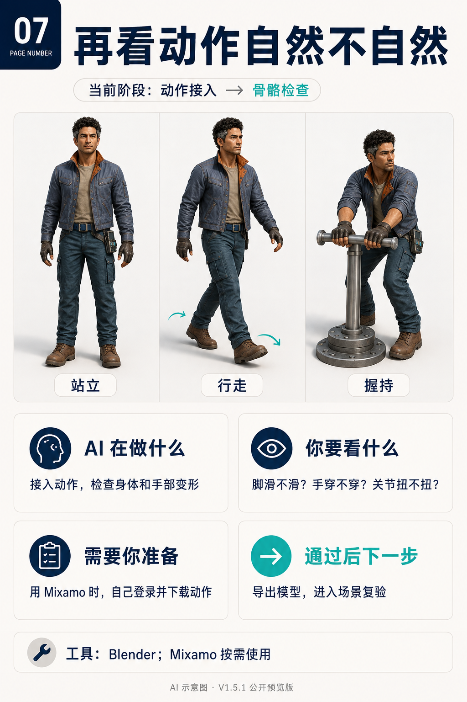
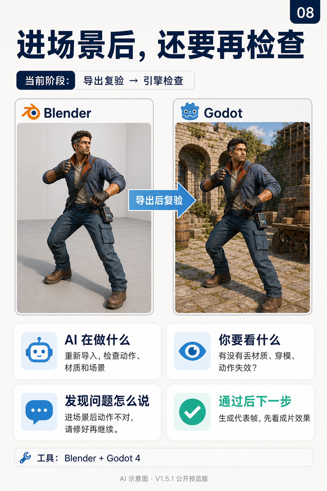
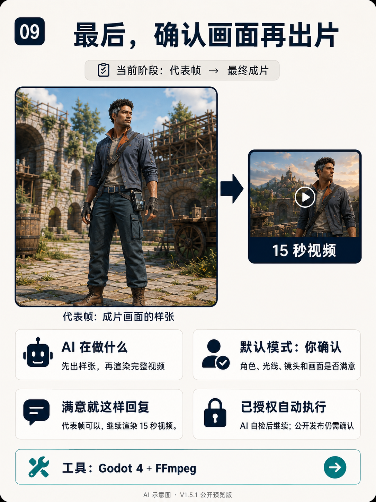

# 3d-pipeline V1.5.1 使用指南

[返回首页](../README.md) · [下载 V1.5.1](../3d-pipeline-v1.5.1-public.zip?raw=true)

> 本文以 15 秒、9:16 广告为例。V1.5.1 是仍在修复完善的公开预览版，33 项单元测试通过不代表所有项目都能完成。所有配图是 AI 辅助生成的教学示意，不是实机截图、质量测试证据或实际成片。

## 1. 下载并安装

1. 点击上方下载链接，将 ZIP 解压。
2. 找到包含 `SKILL.md`、`INSTALL.md`、`scripts` 和 `references` 的整个 `3d-pipeline` 文件夹。
3. Windows 下放进用户目录的 `.codex\skills`。最终结构应为：

```text
C:\Users\你的用户名\.codex\skills\3d-pipeline\SKILL.md
```

4. 若已有同名 Skill，先备份原文件夹；不要直接混合覆盖。
5. 重启 Codex，在新任务中输入：`使用 $3d-pipeline，先检查我的环境。`

安装完成只代表 Codex 能读取指令，项目的软件连接、资产和输出配置还需要检查。不要只复制 SKILL.md 而遗漏配套脚本。



## 2. 需要哪些软件和插件？

| 工具 | 是否必需 | 用来做什么 |
| --- | --- | --- |
| Codex + 本 Skill | 必需 | 组织项目、执行脚本、记录状态 |
| Python 3.10+ | 必需 | 运行执行器及检查脚本 |
| Blender 4.x | 必需 | 处理模型、骨骼、动作和导出 |
| Godot 4.x | 必需 | 自动编排场景、镜头、灯光和渲染 |
| FFmpeg / FFprobe | 必需 | 视频封装与技术检查 |
| Blender MCP | 按项目启用 | 实时操作 Blender GUI；必须验证真实连接 |
| Mixamo | 按动作方案选用 | 外部绑骨/动作服务；用户自行登录并取得合法文件 |
| AI 3D 生成服务 | 需要生成正式资产时选用 | 按项目确定可用模型、预算、素材权利和重试上限 |

Godot 默认使用 CLI 和项目 GDScript，不要求 Godot MCP。“UE 质感”是美术目标，本包使用 Godot 4；并不是 Unreal Engine 插件。

**替代方案需要项目配置，不能直接当成已接通的插件。**

- 绑骨/动作方案可评估 Rigify、Auto-Rig Pro 或 AccuRIG；它们不一定是 Mixamo 的直接替换，需确认支持的角色和输入输出格式。
- 运镜先用 Godot 的 Camera3D + AnimationPlayer；复杂项目再评估 Phantom Camera。
- 普通物理先用引擎内置方案；大型地形才按需要评估 Terrain3D。
- 插件版本、授权费用和兼容性由当前环境检查确认，不默认安装全部可选工具。


## 3. 小白复制这段即可开始

```text
使用 $3d-pipeline 制作一条 15 秒、9:16 的 UE 质感 3D 广告。
要求：原创角色、明亮自然光、画面干净无杂色、纹理克制。

先检查我的软件与插件，告诉我缺什么、如何部署。
再确认本项目脚本、资产清单、预算和输出位置。
请配置并执行本项目。每次只说明：
当前步骤：
已完成：
还缺什么：
我需准备或确认什么：
下一步：

付费调用先确认预算。
默认先给我代表帧，我确认后再渲染完整视频。
```

你仍需提供广告主题、产品或角色资料、剧情要求及有权使用的素材；参考图只用于说明目标，不自动证明素材授权。

## 4. 自动执行到哪一步？

| 检查阶段 | 通俗解释 |
| --- | --- |
| preflight | 软件路径、版本和项目环境检查 |
| blender_mcp_gate | 需要 MCP 时验证 Blender 真实连接 |
| asset_gate | 检查模型、材质、手指和可绑定性 |
| mixamo_handoff | 按项目动作方案配置接入 |
| rig_gate | 检查骨骼是否真正带动身体和手指 |
| export_gate | 导出后重新导入检查 |
| godot_gate | 检查引擎内的动作、场景、镜头及交互 |
| representative_frame | 生成实际场景的代表帧供检查 |
| final_render | 在相应授权和检查通过后渲染成片 |



默认模式在代表帧等待你确认。若你明确授权受控无人托管，执行器才可以在项目范围内自检并继续到最终成片，保留代表帧、关键帧和检查报告。

```text
本项目授权使用受控无人托管模式。
在已确认的资产范围、预算和重试上限内执行到最终成片，
保留代表帧、关键帧和检查报告。
```

这段授权不解决缺文件、检查失败或用户登录问题，也不自动授权购买许可、公开发布或项目外操作。付费重试需包含在授权中，按项目上限顺序执行。


## 5. 图解：你需要看什么？

### 模型是否正确

检查角色是否符合需求、道具有没有缺件、手指有没有粘连。技术检查由执行器完成，你可以用自然语言反馈。



### 动作是否自然

查看脚滑、手部穿模和关节扭曲。使用 Mixamo 时，需要自己完成登录并准备角色/动作 FBX。



### 进入场景是否正常

Blender 中正常不等于 Godot 中正常。执行器需复验材质、骨骼变形、场景关系及镜头。



### 代表帧是否满意

代表帧是成片样张，检查人物、光线、材质和镜头。默认模式满意后回复：

```text
代表帧可以，继续渲染完整 15 秒视频。
```

需要修改时，说清具体问题，例如：“只提高面部亮度，其他保持不变，重新给我代表帧。”



## 6. 遇到卡点怎么继续？

| 现象 | 让 Codex 做什么 |
| --- | --- |
| Skill 没被识别 | 核对文件夹层级和 SKILL.md，重启 Codex |
| 软件或插件缺失 | 列出准确缺项、版本、部署步骤，检查完成再继续 |
| pending / configured: false | 为本项目补齐真实资产路径、命令和报告，不是直接跳过 |
| MCP 已安装但未连接 | 检查协议握手和场景读取结果 |
| 模型或动作检查失败 | 定位失败原因，修复后重跑该阶段；不要改报告伪造通过 |
| Git/测试等工程进度与九步不同 | 前者是当前任务计划，后者是固定生产检查阶段 |
| 没有代表帧确认 | 默认模式等待确认；已明确授权的无人托管模式由执行器检查 |
| 文件或配置发生变化 | 重新检查受影响阶段，旧审批可能失效 |

## 7. 验证安装

在 PowerShell 运行：

```powershell
$skill = Join-Path $env:USERPROFILE '.codex\skills\3d-pipeline'
python "$skill\scripts\pipeline.py" --help
python -m unittest discover -s "$skill\scripts\tests" -p 'test_*.py'
```

本次发布包的 33 项单元测试已通过。帮助命令和测试通过证明执行器可运行，不能替代正式资产、实际引擎场景和最终视频的验证。

下载后的 ZIP 可计算 SHA-256：

```powershell
Get-FileHash -Algorithm SHA256 -LiteralPath '.\3d-pipeline-v1.5.1-public.zip'
```

预期值：`6DE5EB5758C7A6B7D2D2EA6CBE6413F9258975F7153A120C0B48B852B8171D16`。

## 版本与许可

V1.5.1 增加项目级多模型顺序路由和受控无人托管说明，沿用环境、角色/载具/道具关系、运动方向及 VFX 语义检查。仍在修复完善，反馈问题时请说明版本、所处阶段和去除凭据后的错误信息。

本仓库暂未附加开源许可证。除下载、安装和本地评估之外的复制、修改、再分发或商用授权，以权利人后续说明为准。

